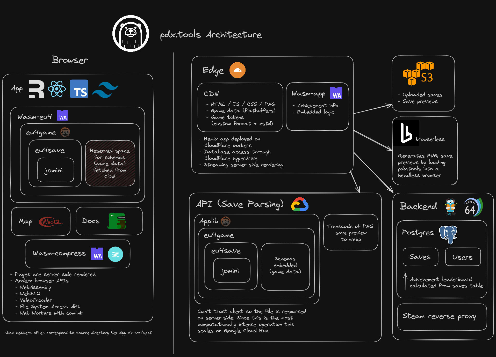

<h1 align="center">
<a href="https://pdx.tools">PDX Tools</a>
  <br/>
  Explore the world you created
  <br/>
  <a href="https://discord.gg/rCpNWQW"></a> <a href="https://github.com/pdx-tools/pdx-tools/actions/workflows/ci.yml"></a> 
<br/>
<br/>
  
</h1>

PDX.Tools is the workbench for [EU4](https://en.wikipedia.org/wiki/Europa_Universalis_IV) insights and storytelling. No installs, just drop a save file and watch your world unfold. Everything parses locally until you choose to share.

Ready to explore maps, timelapses, and charts?

- See the hidden levers: Analyze institution development pushes, plan religion swaps, line up inheritances, and discover events that haven't fired yet so you can pivot before it's too late.
- Stay in the flow: Surface the same stats you'd dig for in-game, only faster than launching the client.
- Keep every era alive: Load saves on old patches alongside the latest version and compare them in one place.
- Tell richer stories: With interactive maps, time-lapse videos, screenshots, new map-modes, and offline exports, AARs practically write themselves.
- Share and compete: Upload saves and compete in the global achievement speedrun board that favors recent patches, keeping the leaderboard evergreen and fresh.
- Extensible: Support already stretches beyond EU4 to [EU5](https://en.wikipedia.org/wiki/Europa_Universalis_V), [CK3](https://en.wikipedia.org/wiki/Crusader_Kings_III), [HOI4](https://en.wikipedia.org/wiki/Hearts_of_Iron_IV), [Victoria 3](https://en.wikipedia.org/wiki/Victoria_3), and [Imperator](https://en.wikipedia.org/wiki/Imperator:_Rome). Every adapter melts binary saves into human readable files, and are ripe for contributions!

## Contributor Guide

If you'd like to contribute, you've come to the right place! This README should hopefully get you started on your journey. If you get stuck or have a bug report you can [file it here](issues) or chat about it [on the discord](https://discord.gg/rCpNWQW)

1. Install [mise](https://mise.jdx.dev/). Mise is a task runner and will download all dependencies.
2. Within the pdx tools repo, ensure all dependencies are up to date with:
  ```bash
  mise install
  ```
3. To develop against plaintext / debug CK3, Vic3, Imperator, and HOI4 saves on localhost:3001
  ```bash
  mise run dev:app
  ```

Next steps:

- **EU4 & EU5 developers**: Prepare the EU4 and EU5 assets, like the map and game data, to be consumed within the browser.
  ```bash
  mise run assets:compile
  ```
- If desired, enable support for [binary and ironman saves](#binary--ironman-saves).


PDX Tools repo also contains a [Dev Container](https://code.visualstudio.com/docs/devcontainers/containers) for those looking for a complete development environment in a single package.

### Start server

To start the PDX Tools:

```bash
mise run dev:app
```

This will start the web server on port 3001.

To develop against the frontend and backend services:

```bash
mise run dev
```

Docker will be required to run backend services.

### Binary / Ironman saves

By default, ironman and binary files will be unparsable. If you are in possession of a binary token file, you can unlock processing binary saves by placing the token file under the assets directory:

```plain
assets/tokens/eu4.txt
assets/tokens/ck3.txt
assets/tokens/hoi4.txt
assets/tokens/vic3.txt
assets/tokens/imperator.txt
```

They will be detected and integrated when the dev server is restarted.

## Contributor Project Guide



### Design Strategy

What follows is **opinionated** documentation for the vision that grounds PDX Tools development and deployment based on past experience.

PDX Tools is a [**frictionless**](#frictionless) web app that features second-to-none [**performance**](#performance) in save file analysis with a [**fault-tolerant**](#fault-tolerant) and [**spartan**](#spartan) backend for hosting files and an achievement leaderboard.

#### Frictionless

There should be minimum friction between a user hearing about PDX Tools and their first save analysis. For that reason, PDX Tools is a web app:

- There is nothing the user needs to download and install
- A web app has less of a chance of being flagged by antivirus
- Sans browser differences, browsers present a unified API for app development with the same look and feel
- Updates are automatically applied whenever the user visits the site

Once the site is loaded, the experience remains frictionless with user registration not required for local save analysis.

To facilitate sharing a save file with others, users can upload the file to the server after logging into Steam. The majority of the gaming user base should already have a Steam account, as Steam is a major distributor of Paradox games.

PDX Tools should strive to be compatible with a large portion of major browsers, so users aren't forced to download and install a specific browser.

- PDX Tools is only possible due to the [ubiquity](https://caniuse.com/wasm) of WebAssembly support.
- Secondary features, like the file watching via the [File System Access API](https://caniuse.com/native-filesystem-api) are fine to be limited to only browsers that support the feature.
- An exception, PDX Tool's WebGL2 map predated the implementation in Safari, but user data showed that Safari usage to be in the low single digits and was determined to be a fine trade-off for this keystone feature.

PDX Tools is geared towards desktop users with a dedicated GPU, however mobile users and integrated GPU users should still be able to use PDX Tools, so they don't need to wait until they are at a more powerful computer to derive value.

- The native texture size in PDX Tools is 5632px wide, but lower end GPUs may only have a max texture size of 4096, so the textures are split into two 2816px images and stitched together at runtime.
- The width of the default float point precision (`mediump`) is often 32 bits on dedicated GPUs but 16 bits elsewhere. Instead of annotating with high precision (`highp`) and suffering performance consequences, meticulous device testing teased out exactly where high precision was necessary.

#### Fault-tolerant

While PDX Tools receives invaluable community contributions via knowledge sharing and suggestions, the site is first and foremost a side project with a bus factor approaching 1. Therefore, everything should be built such that in the event of a catastrophe (eg: backend goes down or service billing issues) the main use case of save file analysis is not impeded.

Ensuring the site can be composed of static files onto a CDN is a cheap (ie: free) way to introduce fault tolerance. By embedding the file analysis engine inside static files, client side compute is leveraged for local and remote files. The backend plays no role in analysis. The static files contain the code and S3 contains the data.

PDX Tools is a heavily aligned SPA; everything takes place inside a single view, so no one can fault the reliance on React to drive the UI. And no one can fault Next.js usage to statically render pages and provide an API to coordinate authentication and database actions. Server side rendering is avoided as that would necessitate the backend being healthy.

Increasing fault tolerance further seems to have doubtful value. It is ok to have a dependency on the domain name and internet connection.

#### Performance

Countless hours have been spent optimizing every level of the PDX Tools stack. Rust is a major component in the performance story, not because it is inherently fast, but it allows one the ability to eke out every last bit of performance while still being ergonomic and less error prone.

At the lowest level, the save file parser is modeled after the tape-based library [simdjson](https://github.com/simdjson/simdjson), known for parsing JSON at gigabytes per second. All performance hypotheses are executed against realistic benchmarks. Profiling via valgrind and kcachegrind have been invaluable in pinpointing potential performance hot spots.

Failed optimization hypotheses like rewriting the [parsing loop to use tail calls](https://blog.reverberate.org/2021/04/21/musttail-efficient-interpreters.html) led to the discovery that patterns in the data can be exploited to make the branch predictor much more successful.

Doing less work is often more performant, so users of the parsing library can opt into parsing and deserializing in a single step which allows the parser to skip data unnecessary for deserialization.

The parser is routinely fuzzed as new optimizations may uncover undefined and potentially unsafe behavior.

The performance characteristics of native code do not always translate to Wasm. PDX Tools stressed Chromium's allocator and a [bug was filed](https://bugs.chromium.org/p/chromium/issues/detail?id=1294262) as it was 100x slower than Firefox on certain platforms. Within a span of a month, Chromium's team identified and fixed the issue.

Save files are Deflate zip files. Profiling showed the DEFLATE algorithm as a major contributor so an [investigation was launched](https://nickb.dev/blog/deflate-yourself-for-faster-rust-zips/) which found removing abstractions yielded a 20% increase in read throughput and switching to libdeflate had an 80% improvement.

Deflate is no longer state of the art. [An exploration](https://nickb.dev/blog/there-and-back-again-with-zstd-zips/) into comparing Deflate zips, with Brotli tarballs and Zstd zips showed that Zstd at level 7 could reduce the payload by half without significant latency and app bloat when embedded in Wasm. Reducing the storage and bandwidth requirements by half is a win that can't be understated.

The game assets required are dependent on the version of the game a save file is from. To facilitate concurrent initialization of game assets, PDX Tools peeks at the save file to determine the game version, reports it out, and then parses the entire file while game assets are fetched and decoded.

Game data assets are encoded with Flatbuffers and then zstd compressed. Flatbuffer offers zero-cost deserialization, and zstd offers the best combination of compression ratio and performance. However, Flatbuffers data accessors are not zero cost so data that is accessed in a hot loop, like game token data, is slurped into a Rust-native `Vec`. Since the end result is a native `Vec`, 30% space savings was realized without a performance hit when token data was encoded in a custom format that omitted the overhead that Flatbuffers adds to support random access.

All uploaded files need to be reparsed on the server to verify data. Parsing files is the most intense action on the backend, and removing the responsibility would allow backend deployment on even the most trivial of instances. It was decided to spin the parsing functionality into its own microservice, but the memory requirements (1 GB) proved too much for [many cost efficient hosts](https://nickb.dev/blog/too-edgy-a-serverless-search/). In the end, Rust and GCP's Cloud Run proved a great match with its low cold start latency and elastic scaling.

#### Spartan

In an effort to keep the backend simple and cost efficient, the backend can be considered spartan. Both the Postgres database and the backend for interoperating with it have been designed to be self-hosted on the same instance.

Redis is conspicuously missing from the architecture. It would be a good fit with [sorted set guides](https://redis.io/docs/data-types/sorted-sets/) and [use cases](https://redis.com/solutions/use-cases/leaderboards/) catering directly to leaderboards. It also would be perfect as a session store to know whether a user session is still valid. Redis is missing as two databases are harder to manage than one. We can [fashion a leaderboard out of Postgres](https://nickb.dev/blog/favoring-sql-over-redis-for-an-evergreen-leaderboard/), and session reuse after logout is not a large enough threat vector so stateless JWT tokens are an ok compromise for user sessions.

Self-hosted Postgres is the database of choice for persisting data related to users and their saves. CRUD operations play an important but small role, and scalability is not a concern. Hosted databases like RDS or Neon charge for instance hours and would be an outsized cost on the service. Alternative providers that use DB size and rows read like PlanetScale, are attractive but would require a migration to MySQL, which, while an adequate database, is something to consider if database scalability becomes a concern.

One could make the argument that the database could be even easier to manage if SQLite was used, which would make the data housed in a single file and eligible for global replication services like Turso and the upcoming Cloudflare D1. Besides database scalability not being a current concern, SQLite's lack of efficient array indexing would require a schema change to add a table for achievement leaderboard calculations, and having only one row in one table for each uploaded save would be tough to give up.

File storage is cost efficient when using low cost S3 compatible services like Backblaze B2 and Wasabi, which offer 1 TB of storage for $6 and $7 per month respectively, and much cheaper (or even free) egress. For PDX Tools, Backblaze B2 is sufficient and the egress fees shouldn't apply as S3 file retrieval is proxied through the edge at Cloudflare, which is a bandwidth alliance partner (and additionally caching headers can be appropriately customized).

Uploaded files are sent to S3 through the backend. This may be surprising, as when talking about uploading user content to S3, the default recommendation is to always use a presigned URL so that the user uploads directly to S3, bypassing the backend. However, the simplicity of sending files through the backend to be parsed and persisted to the database in the same step as the upload should not be underestimated. Even though this required splitting Next.js hosting between providers to avoid the Vercel body limit, this compromise has still been worth it. Read the [dedicated article](https://nickb.dev/blog/split-nextjs-across-hosting-providers-and-advocate-for-direct-s3-uploads/) for more information.

## EU4 new dlc instructions

Generate [province terrain mapping](https://pdx.tools/blog/calculating-eu4-province-terrain)

  - Start new normal game as France
  - [Run](https://eu4.paradoxwikis.com/Run_files) [`terrain-script.txt`](assets/game/eu4/common/terrain-script.txt)
  - Save file as `terrain-<major.minor>.eu4`
  - Upload file to `terrain` directory in the eu4saves-test-cases S3 bucket

Generate game bundle for repo:

```bash
mise run assets:bundle
```

Upload the new entry in assets/game-bundles to the game-bundles directory in the pdx-tools-build S3 bucket

Finally:
 - Update achievement detection logic with any changes
 - Add new 1444 entry for patch
 - Generate binary tokens
