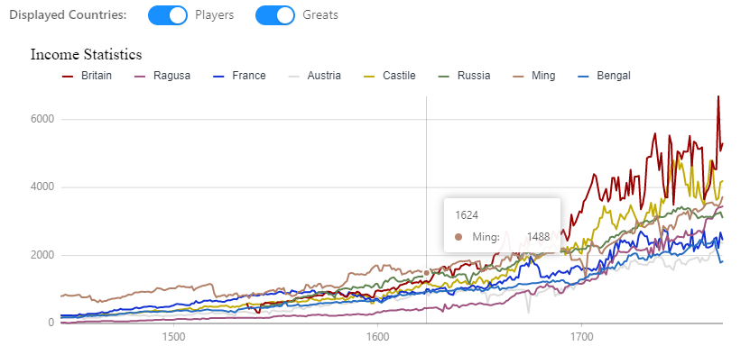

  

Welcome to the launch of Rakaly! Rakaly is an unofficial [EU4](https://eu4.paradoxwikis.com/Europa_Universalis_4_Wiki) achievement leaderboard that
houses an in browser savegame analyzer. Since this is an initial launch,
things are pretty limited. Many achievements aren't implemented, but I didn't
want to delay any longer in order to receive community feedback.

<!--truncate-->

[Head over to Rakaly](pathname:///)

[Join the discussion over on Discord](https://discord.gg/rCpNWQW)

Below is a screenshot of Rakaly

*A view of available achievements*

## Goals

Create a leaderboard that is accessible to casual EU4 players. There are around
300 achievements in EU4 and even if only half make sense to construct a top 10
leaderboard for that still leaves 1,500 positions to fill. Hopefully this
encourages EU4 players to continue to play EU4 how they want to and not feel
pressured into tactics they consider too gamey or nation ruin to shave a few
days off their time. Undoubtedly there will be hotly contested achievements
where every day will matter, but there should be plenty of room for all.

To keep the leaderboard approachable, recent patches will be weighted
more favorably. The thought behind this is threefold. It encourages players to
reattempt older achievements using new mechanics, allows for newer players to
dethrone old records, and naturally causes runs that could be considered a bit
too exploity to lose their spot over time. I still want to preserve truly
exceptional playthroughs, so I don't have an exact calculation set in stone
(hint: community feedback). The main goal is to keep the leaderboard fresh and
approachable. As writing this, 1.29 saves have a 10% tax.

On the topic of exploits -- they are allowed. Some achievements are difficult
to complete without some sort of gamey tactics. This is something that we can
keep an eye on. But as a rough guideline, if you see it on a [Florry
stream](https://www.twitch.tv/florryworry), or on a video by another EU4 content
creator
(eg: [Chewyshoot](https://www.youtube.com/channel/UC9DPjZJWe977Omwjuak3TGg), [Radio Res](https://www.youtube.com/channel/UCkzlzDPjO4oqppnwRsWateg), [Arumba](https://www.youtube.com/user/arumba07), [Zlewikk](https://www.youtube.com/user/Charl1eSheen7), etc), you're fine. [Spiffing Brit maybe not so much](https://www.youtube.com/watch?v=rJYz5yydVqo). We'll see.

Rakaly isn't just going to be leaderboard focussed. In fact a leaderboard
wasn't the reason why Rakaly was developed, as a significant number of players
don't run an achievement compatible game (eg: mods, multiplayer, easy
difficulty, etc) and I want Rakaly to be able to cater to everyone in the
community. So keep in touch, if Rakaly doesn't serve your interests today, it
may in the future (also feel free to chat with me about what your dreams are
for Rakaly).

## Leaderboard Limitations / Rules

- There's a dearth of [implemented achievements](pathname:///eu4/achievements). Don't
  worry! The plan is to implement an achievement every other day with priority
  given to ones suggested by the community.
- Include only achievements that are rated at least a medium difficulty. Per
  community feedback, I'm fine adding an easy achievement if a leaderboard makes
  sense for it.
- All leaderboards are scored based on the number of days since November 11th,
  1444. There is currently not a leaderboard for things like "most casualties
  in a war", "most developed province", "most earned from war reparations"
  (though to be honest, that last one sounds interesting).
- Only record breaking 1.29+ ironman compatible saves will be accepted for uploads.
  This'll make sure that there isn't a flood of games that the server can't
  handle. The good news is that the plan is that once a patch is supported for
  uploading, it will be supported ad infinitum for those users who have a lot
  of records on patch 1.29 but discover Rakaly fashionably late after Emperor
  drops
- All achievements must be completed starting in 1444 without custom nations
  and normal province tax and manpower modifiers. Random new world is
  disallowed. These requirements prevent certain achievements from being
  possible.
- All records are taken at the time of the save. While some achievements can be
  backdated (eg: owning provinces x, y, z), others can't be backdated (eg:
  production leader in cotton), so to keep things simple, no achievements will
  be backdated.
- The same playthrough can be uploaded more than once at varying dates.
  Uploading an earlier save will cause records from previous overlapping
  achievements to be removed from the leaderboard. Later saves are only
  eligible for the leaderboard if there's a new achievement accomplished in the
  save. Only the user account that uploaded the original save is allowed to
  upload the save at varying dates.

## Analysis Engine

This may be something that may only excite me, but I am looking forward to
reaching the potential for the in browser analysis. All saves are open to
this, ironman, normal, and multiplayer games. One does not need to sign up for
an account at Rakaly to analyze their save. The goal is that while the leaderboard is
ironman focussed, the analysis is for everyone (mods can work, but unmodded
provides the best experience).

On a technical level, lots of fancy things happen behind the scenes to be able
to crunch through a savefile. It's deserving of a dedicated blog
post. The desire is to be able to expose everything in a save however the
user wants.

To give a sample, below is an income ledger throughout time where one can
toggle which countries are displayed (click to expand).

*Interactive income ledger*

This is the very tip of the iceberg even for just this chart. Imagine charting
current rivals, past rivals, past greats, or any custom selection where you
can slice and dice time ranges and plotted countries.

Imagine a timeline of events: monarchs, heirs, generals, wars.

Imagine charts of casualties across time.

Imagine a graphical breakdown of military strength across countries.

Imagine a network graph depicting relations between countries.

Yes, your imagination has to be used for a lot of things, but the great thing
is that uploaded saves will benefit from new features as they are released. So even if things look a little bare now, over time it will fill out.

One of the goals of analysis is for everyone to glean insights into record
settings playthroughs. Does the record holder have some sort of skill we all
lack, or are they just incredibly lucky. Are there idea groups well suited for
achievements or is it better to sink your monarch power into other areas.

## On Skanderbeg

Another site popular with EU4 players, especially among the multiplayer
community, is [Skanderbeg](https://skanderbeg.pm/). Great site, everyone should
use it. Skanderbeg does some amazing map projections and aggregates a ton of
data.

The devs behind Skanderbeg and Rakaly are currently working together and are pleased to announce that all saves uploaded to Skanderbeg are [visible in Rakaly](pathname:///eu4/skanderbeg). So until Rakaly opens the upload gates to all saves, they can be uploaded to Skanderbeg and shared that way. Pending community feedback and reception of Rakaly, look to find Rakaly integrations in Skanderbeg!

It is my hope that players find Rakaly and Skanderbeg complement each other.
It is a non-goal to reimplement Skanderbeg features in Rakaly as it's my
opinion that the EU4 community would benefit from Rakaly and Skanderbeg
harmonizing instead of competing.

## On Speedrun.com

When I first mentioned creating a leaderboard, a number of people were
skeptical that the effort would be worthwhile as [EU4 is available on
speedrun.com](https://www.speedrun.com/eu4). Speedrun is a great site, but I
find it is too generic and constrained. Speedrun requires video evidence, and
that is too difficult of a hurdle for most. In addition, there are lots of
rules to follow in order to submit a run. It's discouraging, but it's what the
team behind the EU4 speedrun have to work with given the speedrun framework.

Rakaly is much more interested in allowing players to play as they like with as
few restrictions as possible. Play the game at 2 speed over the course of a
month, for all Rakaly cares. No video proof necessary, just the savefile. This
is what differentiates Rakaly and makes it worthwhile, as it is targeted
towards the casual EU4 player.

## The Future

This is the bare minimum in order to launch Rakaly. There are tons of features
in the works, but I needed to get something out the door for community
feedback.

There will be bugs -- those will be ironed out in time. Keeping the initial
release minimal will allow Rakaly to work through growing pains that are inevitable
when a site goes public.

Here's what the future may hold -- nothing is set in stone:

- Any HOI4 or Imperator players? The logic used for digesting EU4 saves is generic enough to be repurposed. We could see analysis and leaderboards for other Paradox games.
- Any mobile users? The site site isn't mobile friendly, but maybe it doesn't need to be if no one goes to Rakaly on their phones.
- Are there users unable to use Rakaly due to the requirement of a modern browser? Rakaly is aimed to be compatible with 90% of browsers with the thought that the remaining 10% are corporate users on outdated browsers.
- Any interest in custom achievements? Why limit to just the achievements by Paradox. Paging [/r/eu4achievements/](https://www.reddit.com/r/eu4achievements)!
- What about private leaderboards?
- An auto-Autosave uploader?
- Any users strongly against logging in via steam?

Or do all of these inquiries take a backseat to more achievements and visualizations!

I ask readers to keep in mind that Rakaly isn't free to run, especially with
the features that are in the pipeline. I haven't fleshed out a plan to make Rakaly
sustainable. I do know that Rakaly will always provide the in browser analysis
engine to users without requiring an account, and will always let users with an
account upload a record breaking save. I have enough resources to sustain
Rakaly for quite some time, but I want to make the community aware that I'm
open to sustainability ideas.

## What's in a Name?

Rakaly is derived from the following:

 - Paradox's logo is a fossilized platypus
 - Water rats are the platypus's natural predator
 - Recently "rakali" has become the common name for water rats
 - Rakaly is a play on rakali

Since the rakali are known as Australia's otter, Rakaly's logo is an otter.
