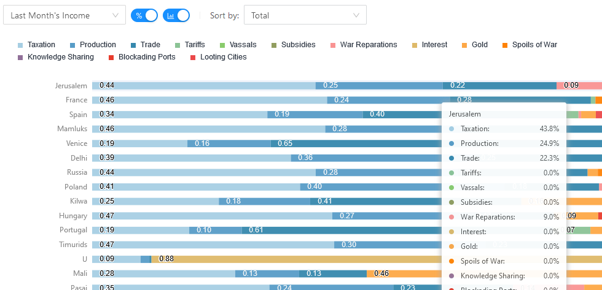

<div style={{textAlign: "center"}}>
  
</div>

EU4 savefiles contain plethora of data about the world. Part of the data
describes where a country gets its income, both recurring and one time
windfalls. There isn't a one size fits all approach to interpreting this data,
so Rakaly allows one to see the income breakdown in a chart so one can easily
spot anomalies or in a table for closer scrutiny. In addition to the magnitude
of each income factor, Rakaly allows one to view factors as a percentage of
the total income to answer questions like "which countries are most dependent
on gold income as a percentage of their total income".

<!--truncate-->

In total, that means there are four ways Rakaly lets one view the data.

Chart of the income magnitudes:

[](ledger-income-chart-magnitude.png)

Chart of the income proportions:

[](ledger-income-chart-percent.png)

Table of the income magnitudes:

[](ledger-income-table-magnitude.png)

Table of the income proportions:

[](ledger-income-table-percent.png)

What type of breakdown you see is controlled by a couple of toggles:

[](ledger-income-toggle-control.png)

## Calculating the Data

It would be nice if the files had a nice self describing format for extracting
income just like how it is displayed in game.

[](eu4-ledger-income-overview.png)

Unfortunately, it's not this easy as the saves give us the following list of
numbers without context:

```
income={
   248.073 466.293 107.106 46.398 0
   219.262 0 0 82.867 0 0 234.044 0
   0 0 0 0 0 0
}
```

The secret is that the position or index of a number in the list corresponds
to category. The first number (248.07) corresponds to "Taxation" from the
screenshot. Using this method we can fill out several of the positions. This
will only get us so far as it would be rare that a country receives income from
every factor, hence the list has many zero values. 

This is where being able to program comes in handy. One can line up all
income lists from all countries and find out which countries have non-zero
values for a particular index. Then load up EU4, [open the console](https://eu4.paradoxwikis.com/Console_commands), tag switch to the needed
country, and record what the in game ledger says that value is. Since rakaly
allows one to [melt an ironman save](/blog/ melting-an-eu4-ironman-save-into-a-normal-save) (the game mode of my choice), it was quite easy to use this method on many of my saves.

On the topic of the EU4 command console, [skanderbeg](https://skanderbeg.pm/)
devs reported that certain console commands (like `economy` or `powerspend`)
will print the context mapping to `game.log`, which admittedly would be much
easier way to deduce the context.

And if you're curious why the savefiles uses this format to store income data
(and this is speculation), saving this data without context has the potential
to add a non-negligible amount of size to already large savefiles.

## Where are the other Ledgers?

I'm letting last month's income ledger marinate for a bit, as the result
turned out less than perfect. Perhaps the biggest flaw is the performance.
While the data can be shaped in short manner, the actual charting bogs down
the browser for a second or two. It's slow enough to be annoying but fast
enough that my inner laziness is tugging me towards other matters.

A nation's income, when compared to a nation's ducat or mana expenditure, 
should be the easiest to handle. Income has the least number of factors, which has
me worried about how bad the performance would be for the other breakdowns.
There's approximately 30 ways to fritter away money and 50 ways one can spend mana and now I have to take into account performance as well as answer how to meaningfully visualize 50 factors. 

The answer may lie in graphing subsets. Maybe only show player countries by
default, and let the user opt into more expensive visualizations (eg: all countries). We can also get fancy and chart a sample of typical and atypical breakdowns (eg: countries who predominantly get money from gold, trade, subsidies). Another answer may be splitting the income chart into two: one chart for recurring income and another for onetime payments. This can further be sectioned by grouping related categories. For example: "Internal Income" could mean taxes, production, trade, and gold, while "Subject Income" could mean "Tariffs, Vassals, Siphoning Income", etc. A caveat would be that deriving the categories may be hard and there could be additional indirection to comparing individual factors across categories (eg: compare trade to gold income). However this is something that should be considered.

And while I've been focussing on the issues with visualizing many factors,
there's also a limit to the number of columns that should be in a table. I've
received compliments on the income table, despite its many columns, but I
believe it will only scale so far -- even tables have a limit.

## Conclusion

Something is better than nothing, so I've decided to push out the last month's
income before adding more views (expenses, mana usage, etc). The hope is that
either through time or community feedback, a perfect solution will present
itself.

I decided to check my bank account, as it lets one categorize expenses.
There's only 16 categories. It's official EU4 is more complex than life.
