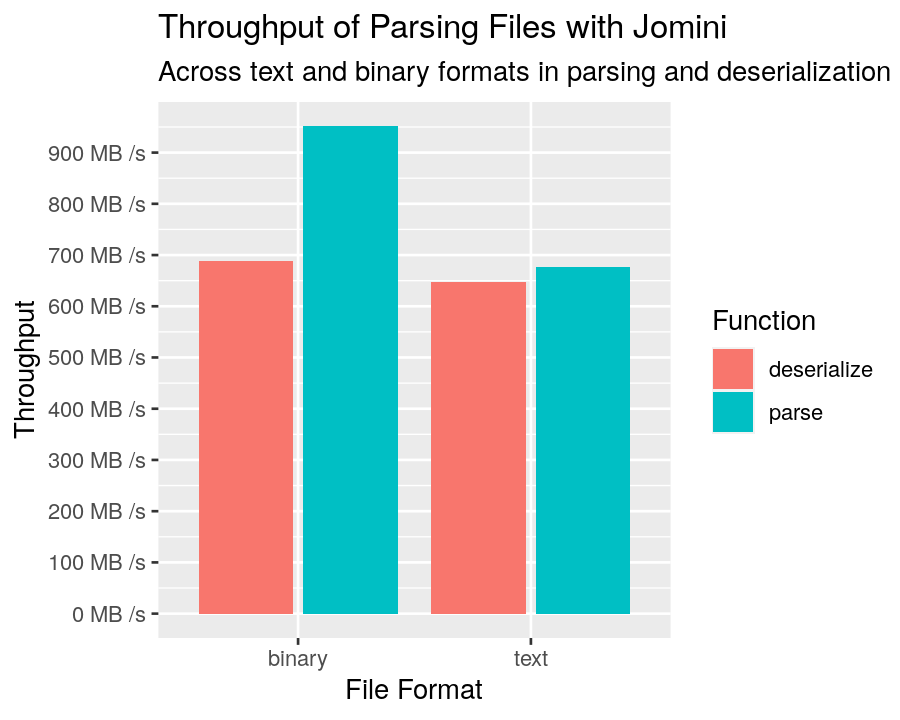

<div style={{textAlign: "center"}}>
  
</div>

There are many layers that need to come together to make Rakaly work. I initially started developing Rakaly 6 months ago, and at the beginning I wasn't sure how the project should be constructed. While the initial scaffolding was fluid to support whatever impulse I had, over time sub-projects emerged. These sub-projects can be extracted and open sourced to the benefit of others. Today the first step was taken and [the parser for text and ironman data has been open sourced](https://github.com/rakaly/jomini).

<!--truncate-->

## The Parser

The parsing layer in Rakaly is called [Jomini](https://github.com/rakaly/jomini). It's such a low level parser (nothing specific to EU4) that I doubt anyone but me will find it useful, but it provides a foundation for not only EU4 specifics but also other titles like Imperator, HOI4, Stellaris.

To give the quickest of examples. Jomini can take the following input:

```txt
human = yes
```

And deserialize it directly to a more ergonomic data structure:

```rust
use jomini::{JominiDeserialize, TextDeserializer};

#[derive(JominiDeserialize, PartialEq, Debug)]
pub struct Model {
    human: bool,
}
```

More examples can be found in the [documentation](https://docs.rs/jomini/).

As depicted in the example, Jomini is written in Rust. The core reasons behind this:

- Flexibility: can be deployed inside browsers, native desktop apps, and servers.
- Performance: See below for a graph of the parsing throughput, but it's safe to say that Rust delivers the best performance out of any of the parsers that I've previously written.
- Ergonomic: quickly write high level code

[](jomini-bench-throughput.png)
*Jomini throughput*

Graph notes:

- Binary file format is traditionally associated with ironman saves
- Deserialization is the step where the raw format is encoded in a more ergonomic and traditional data structure.

## Why Open Source

I decided to start open sourcing Rakaly for the following reasons:

- Quality. I do my best work out in the open. Knowing that others may be perusing the code (ie: my future self), I tend to document and write more tests for open source projects more than others.
- Pride. By writing quality code in the open, I don't have any reservations about referencing the code -- pointing out to friends how an algorithm was implemented or how the parser is fuzzed against generated input billions of times.
- Contributions. While not anticipated, open sourcing allows contributions from the community. In fact, there's already been community help: shoutout to **plecra** on Reddit and [Discord](https://discord.gg/rCpNWQW) who suggested major performance improvements.

Occasionally projects will open source their components to signal their abandonment of the code. This is **not** the case here. I'm always bursting at the seams for ideas to implement for Rakaly and there are some great ideas given in the [Discord](https://discord.gg/rCpNWQW). It's safe to say Rakaly isn't running out of steam.

## The Future

While the parser provides the foundation for Rakaly and save files, it can expand into other areas. For instance, certain game files contain logic like `has_level > 2` instead of `=` that is seen in save files. I'd like to support conditionals (a somewhat niche requirement) without sacrificing performance when parsing save files.

Hopefully this is but the first layer to be open sourced. While I'm unsure if everything will ultimately be open sourced.

I've written many PDS parsers over the years across many languages. I don't have nearly the same level of pride in them and so I'm secretly hoping that I can consolidate them all to use the same logic and just expose a semi-ergonomic interface for each language.
