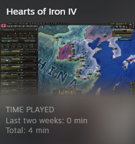

<div style={{textAlign: "center"}}>
  
</div>

This post will be more of a status update -- a sort of grab bag of progress and thoughts that may not fit an overarching theme. I'd like to share what has been accomplished since I've last written.

I wanted to give an update as it may seem like I've gone quiet, as there hasn't been any recent announcements or UI changes in a while. Far from being idle, I've been diligently working behind the scenes. I've logged a significant number of code changes, and this is my break to tell everyone what I've been up to. Fair warning, this may get somewhat technical.

<!--truncate-->

## EU4 Save

10 days ago I [opened sourced Rakaly's foundational parser, jomini](/blog/first-steps-to-open-sourcing-rakaly-foundations). Now I can start releasing higher level code and for the next installment I've open sourced [eu4save](https://github.com/rakaly/eu4save), a library to ergonomically work with EU4 saves (ironman + mp). Below is some sample code that prints the country tag of the player.

```rust
use eu4save::{Eu4Extractor, Encoding, CountryTag};
use std::io::Cursor;

let filepath = "assets/saves/eng.txt.compressed.eu4";
let data = std::fs::read(filepath)?;
let reader = Cursor::new(&data[..]);
let extractor = Eu4Extractor::default();
let (save, encoding) = extractor.extract_save(reader))?;
assert_eq!(encoding, Encoding::TextZip);
assert_eq!(save.meta.player, CountryTag::from("ENG"));
```

Not very exciting but it's what fits in a small code snippet.

The library provides 3 key features:

- The raw data structures to deserialize save files into
- A query engine that works on top of the raw data to answer questions like "what's ENG's trade income?"
- Convert ironman saves to their plain text equivalent

### Ironman

So in the spirit of good news and bad news, here comes the bad news. This library has been purposely handicapped to not parse ironman saves by default. A key that maps 16 bit keys encoded as hexadecimals to their text representations is required to parse ironman saves successfully. The key rakaly uses is not open source.

There are other keys that are open source, the two most well known are paperman and ironmelt. I'll forgo linking them for now as rakaly's key is not open source for legal reasons, so I'm not sure how to navigate this grey matter. The legality may come down to how a key is derived. As far as I'm aware, ironmelt and paperman painstakingly create this key by hand -- rakaly is more ... lazy.

Initially I was planning to open source everything but I wanted to double check and I reached out to Paradox. They told me in no uncertain terms that I must not divulge this key nor talk about how I derived it. They told me I was already in violation of their terms of use, highlighted below.

> you do not and do not facilitate any third party to: A) Modify, copy,
> reproduce, broadcast, republish, sell, resell, exploit, **reverse engineer
> (except to the extent permitted by law), disassemble**, create derivative works
> or distribute in any way any portion of [EU4]

While I disagree and believe that the key is innocuous and I'm only trying to grow the EU4 community, it's not worth putting myself in a compromised position.

So if you're interested in ironman, you're out of luck.

## Javascript

[There's a project of mine, jomini-js,](https://github.com/nickbabcock/jomini) that I started 5-6 years ago that turns paradox files into Javascript objects. It fell into disarray as it was slow and would oftentimes run out of memory. This is somewhat inherent to Javascript, as many people struggle with parsing large JSON objects and EU4 save files can grow quite large as well. I couldn't figure out a solution, so I lost interest over time.

Rakaly/jomini has solved this problem. The parser was written to be embedded and interoperating with Javascript so that it could work server side and browser was the first test. The results so far are good: 3x faster and 1/3 of the memory usage.

It's not finished yet as there is some esoteric syntax that is yet to be supported (namely, operators like `<` and `>`), but if you'd like to give it a try you can install the `@next` version

```plain
npm i jomini@next
```

with some sample code

```js
const test = require("ava");
const { Jomini } = require("jomini")

const encoder = new TextEncoder();
const parse = async (s) => {
  const jomini = await Jomini.Initialize();
  const data = encoder.encode(s);
  return jomini.parseText(data);
};

test("a test case", async (t) => {
  t.deepEqual(await parse("foo=bar"), { foo: "bar" });
});
```

## The Future

I've done more work on the core parser to prepare it for other titles. For instance imperator and stellaris allows one to embed quotes in names:

```plain
custom_name="THE !@#$%^&*( '\"LEGION\"')"
```

And show rgb colors too!

```plain
color = rgb { 100 200 150 }
```

It may seem foolish to lay the groundwork for other games when we're just getting started with EU4 (I wonder how long I'm going to keep saying "we're getting started"), but don't worry, as I never stray far from EU4 as screenshots of my play time for HOI4 and Imperator show.

[](imperator-playtime.png)
*13 minutes total playtime in Imperator*

[](hoi4-playtime.png)
*4 minutes total playtime in HOI4*

The goal here is that by having everything in place, if I have a revelation for a non-EU4 game, I don't have to slog through this development and risk the idea fading. Whether this is a good idea or not ... time will only tell.

I do want to get back to user facing features soon. A lot of the analysis is in a half baked state, and I also want to implement all the good ideas I'm given. There was a really good suggestion on the discord for comparing data across saves and I have a plan brewing. Maybe if I win the lottery and find a way to stop time, I'll have time for everything I want!

Until next time
