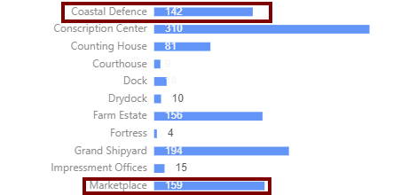

  

Back with some more graphs! [Racing bar charts](https://app.flourish.studio/@flourish/bar-chart-race) are seemingly all the rage now, so of course I must capitalize on this opportunity. I implemented a racing bar chart that tracks how popular a province building is over time. See the gif below for one of my saves!

<!--truncate-->

*A racing bar chart of construction dates for province buildings. Click the gif*

Hopefully one can glean useful insights from it, I know that I received confirmation of a certain AI bias shown below.

*Building count in a passive game in the early 1700's. Coastal defense seems too heavily weighted*

I feel AI is overly zealous when it comes to building coastal defences. The fact that there are nearly as many coastal defense buildings as marketplaces in a game where I'm playing a somewhat passive Switzerlake game is striking. Perhaps the AI doesn't weigh trade power as strongly as it should.

## Future

Some future improvements:

- Track building deletion (eg: when a player conquers a province and deletes all the coastal defenses, the count should go down)
- Provide an alternate view of the annual ledger details (monthly income, nation size, etc) so that one can visualize how nation size and income change over time. This should make those graphs more meaningful when it comes to world conquests (as it would be nice to see top rivals taken down visually)