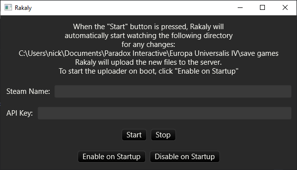

<div style={{textAlign: "center"}}>
  
</div>

First I want to mention I put a bugfix in place for the racing building charts that omitted destroyed buildings. Previously only buildings standing at the date of the save would be considered. This was fine at first, but failed to take into account how a player would destroy coastal batteries and fortifications as they consolidated their country (this may not be as true for multiplayer saves where forts are more necessary).

<!--truncate-->

I don't think I mentioned in the previous post, but the racing building chart should be future-proof mod friendly! Nowhere in the code does it contain logic for dealing with specific buildings (other than the localization, which is nonessential). This is what made deriving a province building history so tricky as a province only records current buildings like so:

```plain
buildings={
    fort_15th=yes
}
```

But if that fort was destroyed, it wouldn't be listed in `buildings` and the history would only record the following if the fort was destroyed

```plain
1755.7.27={
    fort_15th=no
}
```

So the fix was to either hard code the buildings -- or (what I ended up coding): when calculating a province's building history, all provinces are scanned to know what buildings are available so that we can identify what history events relate to buildings.

## Rakaly Desktop

It's been my goal since day 1 for there to be a desktop component to Rakaly that uploads saves while you play. It would work by watching for save files and uploading them to the server when a new one appears. There are two underlying reasons why I want a desktop component:

- As a backup service. The time in ironman when I accidentally mouse clicked, doomed my country, and saved the game is seared into my memory. Yes it was completely my fault, but the burnout I felt from this mistake was great enough to cause me to sit EU4 down for a couple months. I would have save scummed in an instant had that option been available.
- View data over time that the save file only keeps the latest value of. For instance it would be nice to track how a province's development changes over time, or a country's army size, tradition, or discipline. Since only the latest value is recorded for these facets, one would need to look at multiple saves to chart data over time.

So I've been playing around with desktop GUIs and have started piecing one together:

[](desktop-prototype.png)
*The Rakaly Desktop prototype I've been playing with*

To be clear Rakaly Desktop is still a far off dream and this is only the very lowest foundations, but I have some goals that I've made progress on:

- Cross platform. Wherever you can play EU4, you can use Rakaly Desktop
- Efficient. I play EU4 on a potato and so the app can't use any RAM or CPU
- Start on boot. This way one doesn't need to remember to start Rakaly Desktop.

This may sound confusing as Rakaly only accepts achievement record breaking saves at the moment. I've mentioned this before, but there is no technical reason for this limitation, so I plan to lift this limit at some point in the future, but I want to do this with plenty of forethought:

- It's conceivable that one could easily reach thousands of saves. So before I do this, do I need a mechanism to limit this or introduce a way for one to financially support Rakaly?
- I don't think most would want all their uploaded saves to be public so maybe a private setting needs to be implemented

Anyways, this has been the first (public) musing about Rakaly desktop. If you have any suggestions, use cases, or concerns feel free to drop by the discord or email myself.