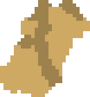
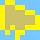
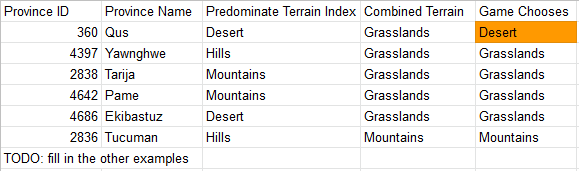
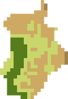
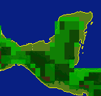

<div style={{textAlign: "center"}}>
  
</div>

One of the many EU4 achievements left to implement [on the leaderboard](pathname:///eu4) is Eat your Greens where one needs to control all grassland provinces in Asia. While the terrain of a province is an easy concept to grasp, it's surprisingly difficult to calculate. 

<!--truncate-->

The first step is to [start at the wiki](https://eu4.paradoxwikis.com/Map_modding) and work backwards.

The wiki mentions there an automatic algorithm that derives the terrain from `map/terrain.bmp` and this algorithm is overridden on an individual province level in `map/terrain.txt`. Before diving into the automatic algorithm, let's examine the manual override.

## Terrain Overrides

Simplified, `map/terrain.txt` contains categories that manually sets the terrain type of a province. In the below example, provinces with the ID of 1034, 1035, and 1104 have their terrain manually set to glacier.

```plain
categories = {
  # ...
  glacier = {
    # ...
    terrain_override = { 1034 1035 1104 }
  }
}
```

We can count how many provinces have their terrain explicitly set with this js script:

```js
const { readFileSync } = require("fs");
const { Jomini } = require("jomini");

const buffer = readFileSync("map/terrain.txt");
const parser = await Jomini.initialize();
const data = parser.parseText(buffer, { encoding: "windows1252" });

const overrideProvinces = Object.values(data.categories).flatMap(
  (x) => x.terrain_override || []
);

overrideProvinces.sort((a, b) => a - b);
console.log(`${overrideProvinces.length}: ${overrideProvinces}`);
```

There are 2275 entries and if we closely examine the output, we see something quite discerning: duplicates!

So let's find the duplicates:

```js
const dupes = overrideProvinces.filter(
  (x, i, arr) => arr.indexOf(x) !== i
);
console.log(dupes);
```

The above will print:

```js
[
     2,   63,   96,  318,
   798, 2074, 2128, 2129,
  2313, 2386, 2666, 2948,
  2970, 4105, 4176, 4298,
  4307
]
```

I checked a few by hand:

- The province id of 2 (Östergötland) is manually overridden as forest and woods. In the game the province is listed as forest.
- The province id of 63 (Erfurt) is manually overridden as hills and woods. In the game the province is listed as hills.
- The province id of 96 (Zeeland) is manually overridden as grasslands and marsh. In the game the province is listed as grasslands.

There's a pattern: the override that is listed first in the file is given preference.

For the other thousands of provinces not listed in `map/terrain.txt` we turn towards the automatic algorithm

## Automatic Algorithm

The algorithm to automatically derive the terrain for a province from `map/terrain.bmp` is not documented, so I've done my best to reverse engineer it.

We first need to find a province that does not have a terrain explicitly assigned (with 2000+ overrides this may be more difficult than first glance). Since I've been having fun with Oman in a playthrough of mine, I landed on Ibra.

If we overlay the terrain around Ibra with how provinces are defined in `map/provinces.bmp` we see that each province features multiple terrain types. 

[](terrain.png)
*Terrain around Ibra*

[](ibra.png)
*Provinces around Ibra (reddish orange area)*

It's intuitive that the predominant terrain in a province area would be the chosen terrain. To test this, one can open both images in an image editor and narrow them down to just a single province.

First we gather some info:

- Ibra has a province id of 4287 (you can verify this by enacting `debug_mode` in the console)
- EU4 reports Ibra as having a desert terrain
- Double check that Ibra does not appear in terrain.txt

Then count the pixels from `terrain.bmp` that appear inside Ibra's borders. Your image editor tools will come in handy here. Below are the counts with the RGB hex in parentheses:

- Light brown (CEA963): 236 pixels
- Brown (9E824D): 135 pixels

[](ibra-zoom.png)
*Terrain.bmp zoomed into Ibra*

Ibra is predominately light brown and the next step is to resolve this color to a terrain type. This is done by looking at the BMP file at a very low level (so low level that I had to write my own BMP parser in my language of choice). BMP files carry with them a color table where the pixels are indexed into the color table which contains the RGB info. This saves on space as pixels can be stored in a single byte instead of 3 or 4 bytes.

Once we know the color table index, we go back to `map/terrain.txt` and lookup what type has the same color table index. Without getting too into the weeds on how to parse BMP files, the color `9E824D` is set by the 3rd color table index, so we resolve the terrain as desert:

```plain
terrain = {
  desert = {
    type = desert
    color = { 3 }
  }
  # ...
}
```

It is good to verify the theory:

- Bihar (157): is mostly covered by the terrain with a color index of 0 (grasslands) and the game renders Bihar as grasslands
- Aqabah (4268): is mostly covered by the terrain with a color index of 2 (mountains) and the game renders Aqabah as mountains
- Ayaviri (2829): is mostly covered by the terrain with a color index of 6 (mountains) and the game renders Ayaviri as mountains

Excellent so now we know roughly how terrain is automatically assigned -- it's by the most popular terrain

## Edge Cases

Before getting too excited, there are several edge cases that must be accounted for.

There are 3 provinces that currently have a tie for the most populous terrain and the province does not have a terrain override:

- Djerba (2954): has the same amount of coastal desert (19) as coastline (35) and the game represents it as coastal desert.
- Macau (668): has the same amount of grasslands (4) as coastline (35) and the game represents it as grasslands.
- Lima (809): has the same amount of desert mountain (2) as mountain (6) as desert (7) and the game represents it as mountains.

The tie is broken by which terrain has the lower color index (in parentheses).

[](djerba-tie.png)
*Terrain.bmp showing Djerba with an equal amountdesert as coast*

Upon closer examination Macau (668) features two types of grassland indices (0 and 4) and combined outnumber the coastline (35). Lima also exhibits this behavior with several types of mountains.

This is another edge case as a given terrain type like forest maps to indices 12, 13, 14, so it's possible that a province could be dominated by forests but if the forest types are split evenly, a different terrain may appear to be dominant. This occurs surprisingly often with about 20 provinces afflicted (and these provinces don't have an explicit terrain type set). So far, I've found that the combined terrain outweighs the predominant terrain as seen in the below spreadsheet. I've outlined the outlier so far. 

[](terrain-sheet.png)
*Combining similar terrain indices to determine terrain*

What's up with Qus? Rivers.

Before we get to the impact of rivers, it's instructive to look at Corfu (142). The defined province area is disproprotionately large compared to the size of Corfu's land terrain, causing the majority of the Corfu province area to be considered inland ocean. Since there is no land province in EU4 that can have a terrain type of inland ocean, we subtract out the water pixels before calculating the terrain. And on the topic of water, let's get back to rivers.

[](corfu-water.png)
*Terrain.bmp showing Corfu is mostly water*

## Rivers

Open up `map/rivers.bmp` and zoom into Qus. There is a river coursing through the province. In `terrain.bmp` the river pixels are colored as grasslands as shown below.

[](qus-river.png)
*Terrain.bmp showing a grassy river*

There isn't a universal terrain that rivers are colored. Some rivers are mountainous and others are grassy, and these colored river pixels are enough to tip the scales of our method in the wrong direction.

The solution is to ignore all pixels in a province's area that are part of a river. I use the following RGB triplets in `rivers.bmp` to know if a pixel is a river:

```
(0, 200, 255) => true, // Bahawalpur (4508)
(0, 100, 255) => true,
(0, 0, 200) => true, // Qos (360)
(0, 150, 255) => true,
(0, 225, 255) => false, // Bregenz (4710)
_ => false,
```

The code comments indicate which provinces would see their terrain change if the the logic was flipped, so be careful to not count all rivers. You can see above that I marked some blue pixels as not rivers, else they will flip some provinces to a different terrain. For instance, we need Bregenz (4710) to be mountains and not hills. If we included the river, it would be marked as hills.

[](bregenz.png)
*Omit certain rivers from consideration like in Bregenz*

The next question to answer is, does taking into account rivers affect our other test cases? The good news is that there are no rivers in Djerba (2954), so the lowest terrain index in a tie still takes precedent. And taking the combined terrain is still used over the single most dominant.

Looking over the provinces, I stumbled upon Tzotzil (4585) which has both grasslands (0) and hills (1) tied, so one would expect the province to be grasslands. What terrain does EU4 assign it? Jungle. How is this possible? Trees.

**Thank you to the helpful folks behind the [Paradox Game Converters](https://github.com/ParadoxGameConverters), who were instrumental in determining how rivers affected the terrain algorithm** 

## Trees

Hardest step for last? Hopefully your eyes haven't glazed over because this last step will require the most critical thinking.

Heavily forested areas are defined by `map/trees.bmp`. There is an issue with this image. It has a different resolution than the other images we've been working with: the trees image is 8x skinnier and around 7x shorter (but not exactly 7x). We can upscale this image using the nearest neighbor approach to get to approximately the same resolution as the other images.

[](tree-override.png)
*Upscaled trees.bmp overlapped with terrain.tmp*

Additionally, just like how terrain.bmp had BMP color indices defined in terrain.txt, so does trees.bmp

```plain
tree = {
  forest = {
    terrain = forest
    color = { 3 4 6 7 19 20 }
  }
  jungle = {
    terrain = jungle
    color = { 13 14 15 }
  }
  # ...
}
```

So we'll also need to map the found indices in trees.bmp back to the jungle and forest indices of terrain.bmp. The upscaling and associating indices can be done in a step like what I've used below (this is just some Rust code that I ripped out of the project -- it's not self contained but hopefully the intent is apparent).

```rust
let province_width = rivers_bmp.dib_header.width as usize;
for (row, data) in trees_bmp.data().enumerate() {
    for (col, pix) in data.iter().enumerate() {
        // Upscale the trees.bmp pixel using nearest neighbor using the
        // resolution ratio between the images.  let start_x = col * 8 - 2;
        let start_y = ((row as f64) * 6.989761092150171) as usize - 2;

        if forest_colors.contains(pix) {
            for x in start_x..start_x + 8 {
                for y in start_y..start_y + 6 {
                    tree_override[x + (y * province_width)] = Terrain::Forest as u8;
                }
            }
        } else if jungle_colors.contains(pix) {
            for x in start_x..start_x + 8 {
                for y in start_y..start_y + 6 {
                    tree_override[x + (y * province_width)] = Terrain::Jungle as u8;
                }
            }
        } else if pix == 5 { // woods
            for x in start_x..start_x + 8 {
                for y in start_y..start_y + 6 {
                    tree_override[x + (y * province_width)] = Terrain::Woods as u8;
                }
            }
        }
    }
}
```

And then use this tree override to overwrite the original terrain at a given pixel. This still follows the same rules that a province can have some jungle terrain but another terrain type can be chosen if it is still dominant.

There is some wiggle room that I may not have accounted for:

- `default.map`: has a comment which states that `tree` defines which indices are used but it doesn't look correct, as jungle is missing
- Thus I only trap for some indices trees.bmp and add them to the terrain override 

## Conclusion

Here are the rules for determining a province's terrain. This has been tested on all provinces on 1.30 and there are 6 provinces incorrectly assigned but this is close enough that I felt confident about publishing.

- If the province id is listed in `terrain.txt`, choose the terrain that lists the province id first
- Else combine all similar terrains with overriding trees and choose the combined terrain that occurs most often in the province's `terrain.bmp` area, subtracting water (river + ocean) pixels, and breaking any ties by preferring terrain with the smallest color index 

So back to the Eat your Greens achievement. The following files are necessary in order to determine if one accomplished it:

- The save file
- `map/continent.txt` to know what provinces are contained in which continents
- `map/definition.csv` to know what color constitute a province
- `map/provinces.bmp` to determine the coordinates of all pixels that are a part of a province
- `map/terrain.txt` for province terrain overrides and the dictionary of color index to terrain type name
- `map/terrain.bmp` to determine province terrain types for those without overrides
- `map/rivers.bmp` determine where river pixels are so we can exclude them from the algorithm
- `map/trees.bmp` determine where trees and if the province should flip to jungle or forest

If I was a better person, I'd add this info to the EU4 wiki in a tone agnostic format without an overarching narrative or code snippets, but I'm exhausted and I could very well be wrong in my conclusions, so at the very least hopefully this has proved informative.

Now I can rest and pick back up implementing Eat your greens.

## Addendum

The following EU4 run script can be used to assign provinces of a certain terrain. This proved invaluable while testing the algorithm.

```plain
every_province = {
    limit = {
        has_terrain = grasslands
        is_wasteland = no
    }
    cede_province = KAL
}

every_province = {
    limit = {
        has_terrain = hills
        is_wasteland = no
    }
    cede_province = FRA
}

every_province = {
    limit = {
        has_terrain = mountain
        is_wasteland = no
    }
    cede_province = SWI
}

every_province = {
    limit = {
        has_terrain = desert
        is_wasteland = no
    }
    cede_province = OMA
}

every_province = {
    limit = {
        has_terrain = marsh
        is_wasteland = no
    }
    cede_province = SWE
}

every_province = {
    limit = {
        has_terrain = farmlands
        is_wasteland = no
    }
    cede_province = HOL
}

every_province = {
    limit = {
        has_terrain = forest
        is_wasteland = no
    }
    cede_province = NOV
}

every_province = {
    limit = {
        has_terrain = coastal_desert
        is_wasteland = no
    }
    cede_province = TUN
}

every_province = {
    limit = {
        has_terrain = coastline
        is_wasteland = no
    }
    cede_province = VEN
}

every_province = {
    limit = {
        has_terrain = savannah
        is_wasteland = no
    }
    cede_province = CRE
}

every_province = {
    limit = {
        has_terrain = drylands
        is_wasteland = no
    }
    cede_province = MAM
}

every_province = {
    limit = {
        has_terrain = highlands
        is_wasteland = no
    }
    cede_province = KAR
}

every_province = {
    limit = {
        has_terrain = woods
        is_wasteland = no
    }
    cede_province = MOS
}

every_province = {
    limit = {
        has_terrain = jungle
        is_wasteland = no
    }
    cede_province = COC
}

every_province = {
    limit = {
        has_terrain = steppe
        is_wasteland = no
    }
    cede_province = KAZ
}

every_province = {
    limit = {
        has_terrain = glacier
        is_wasteland = no
    }
    cede_province = KMC
}
```
