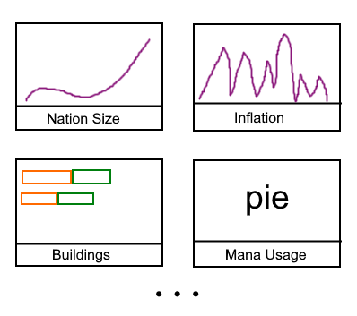

  

Let's start with the eye candy. I posted this a couple weeks back on the discord but I want to highlight it again, as I feel like some may have missed it: a racing bar chart where one can see how nation sizes changed through the playthrough.

<!--truncate-->

*Nation size racing bar chart. Click the gif*

I felt that other visualizations didn't accurately capture how a run progresses. For instance, the great nations at the tail end of a world conquer aren't all that great as they've been reduced to pebbles. The hope with this chart is that it will better portrary the giants that one had to disassemble.

In my mind, I'm mulling over possible interface changes that should hopefully allow for new visualizations to be easily discoverable. I want to introduce a page that shows all the visualizations possible and maybe have a popular or "what's new" sorting so that it is more apparent what Rakaly can bring to the table.

*Preview many Rakaly visualizations at once with thumbnails*

We'll see if this idea sticks.

## Core Improvements

Since the last status report there's been a significant amount of development on the [core parser](https://github.com/rakaly/jomini):

- Save and game files from every PDS game should be parseable (any that aren't is considered a bug)
- Bug fixes for some bizzare syntax found in some EU4 saves
- And introduction of a mid-level API that should be more user friendly (and it greatly simplified the high level API)
- And in spite of all of this, the parser has never been faster!
- If your language of choice is Javascript, I've released a [package on NPM](https://github.com/nickbabcock/jomini) so Rakaly's fast and correct parser is more user accessible. I've talked previously about exposing this functionality in the UI as some sort of pseudo [Jupyter notebook](https://jupyter.org/)

Other than the performance improvements most of these changes are not user visible, which is unfortunate. I tend to spend a lot of time polishing code bases over implementing features.

As an aside, [I wrote about](https://nickb.dev/blog/designing-a-decaying-leaderboard-with-redis) how the leaderboard is implemented at a very technical level -- too technical for this blog, but if you're interested give it a read.

## Oh Kale

Just like how not every EU4 achievement is equally difficult, neither are they equally detectable from the save file. Some are extraordinarily easy to check with only one or two conditions that are found solely within the save file. For instance, to check if a player has formed Italy: extract the player tag, if "ITA" then they completed it.

Eat your greens is far from easily implementable as it requires checking that all asian grassland provinces are owned by the player and as [I've recently wrote](/blog/calculating-eu4-province-terrain), calculating province terrain is extremely convoluted.

The calculation is so involved that I had to write my own BMP file parser to get a low enough level to extract the necessary information. Let me know if there is any interest in open sourcing this parser.

I spent an entire week trying to reverse engineer the province terrain algorithm. And kicker? There's 6 provinces that resist the algorithm and I've spent too long trying to solve them, so I've decided to create a save where all provinces of a certain terrain are owned by a unique country. Then I can analyze the save and write out the terrain based on who owns the province.

I don't have much to show for all the work I've invested, as Eat your greens is still not implemented -- but I hope that this is the first step towards integrating map visualizations.

Eat your greens isn't the only terrain based achievement. The Empire of Mann achievement requires one to conquer all islands in the world, so we'll see if there is an easy way to classify a province as an island or if one needs to resort back to scripting.

But I'd consider this to be a bunch of progress made and maybe one day Rakaly will have th EU4 map that one can drill down to "show me all the grassland provinces in asia"
