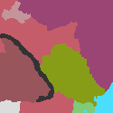

  

EU4 is just a fancy map simulator and any EU4 site without maps would be incomplete. I'm excited to announce that Rakaly now features maps!

<!--truncate-->

*EU4 political map generated with Rakaly*

Right now it's very limited. The only maps Rakaly knows how to generate are political maps at the current date of a save file. I still think this is a very important first step. Lots of possibilities have opened up.

One can export any map Rakaly generates by right clicking and saving the image.

There are three options for controlling how borders are drawn when creating a map:

*Political map without borders*

*Political map with borders between countries*

*Political map with borders between provinces*

## What's Next?

Performance is good, great even for maps without borders: with calculations averaging around 50ms. This makes me hopeful that gifs or mpvs of the world through the years is within the realm of possibilities. The one area that may need attention in regards to performance is calculating country borders as that can take up to 350ms and can be felt. Ideally, map calculations should be seamless, so I may spend a bit seeing if I can eke out additional performance from the browsers.

Then there is interactivity. I want clicking on a province to bring up a sidebar with the province or country information with the option to go to the dedicated tab for more insights. To me, adding additional controls for panning and zooming the map is low priority. The browser controls seem good enough and one can always right click and open the image up in one's image editor of choice.

And of course more map modes are in order. Even the current political map can be improved by showing provinces where the controller is different from the owner. If you have a particular map mode you want to see, leave a comment in the discord.

One thing that I'm not planning on doing is overlaying country (player?) names on the map -- we know how well that can end up.

While Rakaly's map support is in its infancy, I'd recommend continuing to use Skanderbeg.