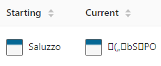

  

It's hard to believe that it's been 6 months since Rakaly has launched. It feels like both a short and long time. I figured it was best to look back at what was accomplished and what is planned for 2021. Overall I'm very pleased with how things have turned out for Rakaly in 2020 and I hope for this to be the first of many annual reviews.

<!--truncate-->

But first, I added a few tables that breakdown the budgets across all countries, so now it is easier to see who has slinged the most ducats to another player or who gains the most through trade.

*Recently added tables breaking down country's budgets*

## A Look Back

When Rakaly was announced, nothing was open source. It took nearly two months for the first bits of code (the low level parser) to be open sourced. Now there is a [whole umbrella holding Rakaly bits](https://github.com/rakaly) and it's hard to imagine life before. Some open source laurels:

- librakaly allows the [Paradox Game Converters project](https://github.com/ParadoxGameConverters/EU4toVic2) to convert binary EU4, Imperator, and CK3 saves to their plaintext equivalents.
- [There's javascript bindings for the low level parser](https://github.com/nickbabcock/jomini)
- [A CLI](https://github.com/rakaly/cli) that one can run on a multitude of platforms to melt save files into their plaintext equivalents.

Developing all this was a several month detour, but I believe this is for the best. It has set solid foundations to build upon. I must thank Rakaly users who have a well of patience they can draw from to tolerate the slow pace of development!

The number of supported achievements have grown from 26 to 47. I essentially implement them at the speed at which I complete them in game, so suggest more achievements if you'd like to see specific ones.

I haven't come across criticism on Rakaly's architecture where the save is analyzed in the browser without the need of a server component. Before Rakaly's initial announcement, I was worried that I may need to rearchitect the application to either be a desktop client needing to be installed or a thin browser view to the server. I believe the hybrid approach offered by analyzing in the browser offers a happy compromise (of course there are still drawbacks but I don't find them outweighed).

I didn't anticipate adding map support in 2020, but I sank enough time unwrangling [how EU4 determines a province type](/blog/calculating-eu4-province-terrain) (for the achievements that require it) that adding a map view was the next logical step.

One thing that I'm proud of is Rakaly's stability. There have been no reported crashes, data loss, or any backend issues of the sort. The biggest commotion was when someone uploaded a save file that used the [EU4 Chinese Language Supplementary Mod](https://steamcommunity.com/sharedfiles/filedetails/?id=1999055990). The mod does not store user entered text in windows1252 format so when uploaded the save looked quite odd on the leaderboard:

*A save from the Chinese Language Mod*

The fix was to prefer the english version when storing data.

## A Look Forward

When initially announcing Rakaly, I spent a bit of time informing the community of its existence (hopefully nothing that would be considered spam). Since then, I've been quiet -- kinda just in the shadows watching the experiment play out. While there is no tracking in the browser, I can gauge the traffic by looking at API calls as users navigate the site. Remarkably there's a steady amount of traffic -- not a lot -- but consistent traffic. Seems like there is a solid base for me to campaign a bit more for Rakaly once some more features have been implemented.

Speaking of features, here is what I'm thinking for 2021 (of course, this is what is on my mind, please feel free to share your desires in the discord).

- More maps (religion, dev, devastation)
- More map features (info box on selected province / country)
- Click to export table to CSV (or excel!?)
- Timelines (monarchs, wars)
- Map timeline gif
- More achievements
- Calculate values involving modifiers (morale, discipline, trade efficiency, etc)

This is a lot and some probably won't make the cut for 2021. All the above are features that are executed client side (eg: one click and drags their save file for analysis), but there are plenty of backend improvements on the docket as well.

### Store All Saves

I want to open up the backend to all saves, not just record breaking ironman saves. We know the analyzer can handle all types, the backend just needs to accept them. This is a tricky subject where the initial rollout may see heavily restricted access (limiting accounts to 10 uploaded saves). As someone with GBs of save files, I must protect myself from uploading everything and potentially cause instability as Rakaly runs on minimal hardware.

On the topic of minimal hardware, I recently introduced a change to the backend that will attempt to uniquely identify playthroughs. We'll see how it goes. The algorithm uses the starting entropy generated by the game and the first 3 years of data to create a fingerprint. Saves that don't pass the threshold of 3 years of data will fallback to using the savefile campaign. When I was reprocessing already uploaded saves to fill in their playthrough id, I repeatedly ran the system out of memory.

While I was able to fix this by processing saves locally and updating the remote database, this led me to re-evaluate where Rakaly is deployed. Reducing costs is one way to make Rakaly more sustainable. I have hardware at home that far and away exceeds the specs that Rakaly is running on, so I'm contemplating transferring Rakaly locally. The hope is that most users won't notice as the analysis is all driven client side -- it's only API endpoints like uploads, leaderboard, logging in that may experience a slowdown.

Once there is a way for users to chip in for additional features (ie: more save upload slots), reducing costs is the next best idea, so that I don't ever feel like Rakaly is a financial drain.

### Steam

I'd like to eliminate Steam login in favor of traditional email based accounts where registration is just "fill in your email" and then once the address is verified the account is created. If the user is ever logged out, simply trigger another login email. The exact details are fuzzy but the migration would look like:

- Allow new accounts to be created with email
- Disallow new accounts to be created with Steam
- Those that had a Steam will still be able to login with Steam but will receive a notification for them to verify their email address.

Originally Steam was leveraged for user accounts to make development easier but I think (with no evidence to back this up) that some are uneasy about logging in via Steam even though no privacy comprising info is given out by Steam. Plus most people should be familiar with the email workflow. I want to reduce all possible registration friction.

### More?

2021 has a lot in store and I haven't even touched upon even loftier goals:

- User generated infographics from the building blocks that Rakaly gives so that users can tell their own story.
- Add support for more games (CK3, HOI4, Imperator)
- I scribbled down the desire for one to live stream their playthrough so that the audience can interrogate the ledger for insights while the streamer remains focussed on playing. Probably super niche, but is something that the architecture allows for.
- Minimal desktop client to upload saves

As always, suggestions welcomed.
