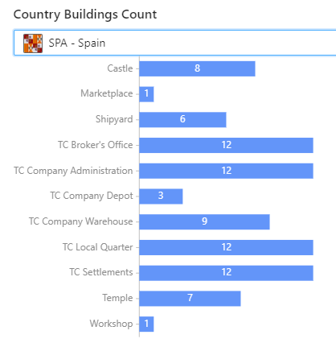
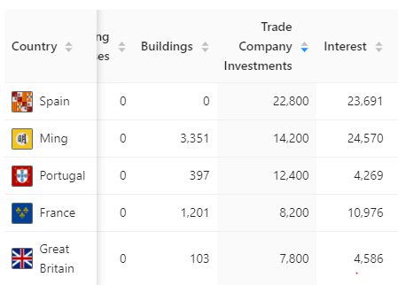
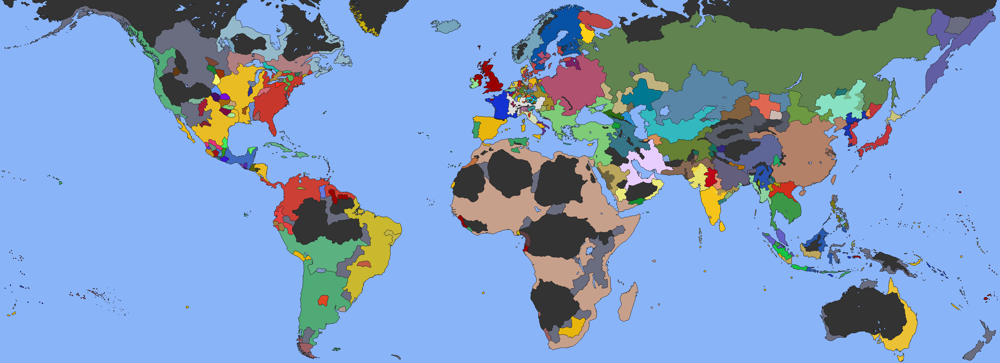
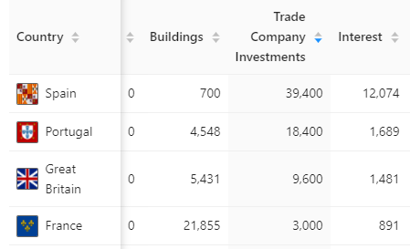
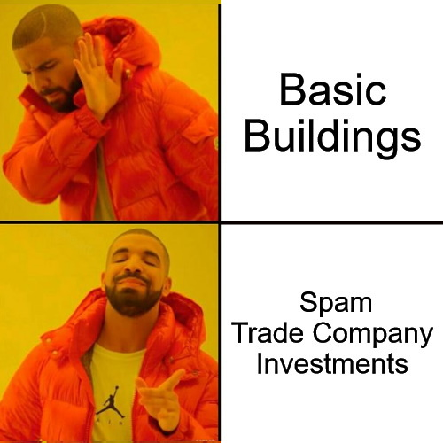

  

While fleshing out the province details view in [Rakaly](pathname:///), I stumbled across a trend: the AI over prioritized trade companies. The AI would prioritize buying investments until every trade company area looked like:

<!--truncate-->

*Spain and France buying every investment*

_Every_ trade company looked like this. Trade companies are definitely meta right now, but not like this.

Surely spending such lavish amounts on trade companies should correlate with a prosperous homeland with workshops and manufacturies -- or at the very least, military buildings, right? Unfortunately, no.

*Number of Spanish provinces that have a given building*

We see the Spanish have built very few buildings outside of trade company (TC) investments. In fact, when checking their total expenses, we can see that they have spent a grand total of 0 ducats on buildings.

*Expenses: Buildings vs TCs vs Loan Interest*

From the above we can see that Spain spent 23k ducats on trade company investments and zero on buildings. Other nations are afflicted with this misprioritization too: investing into trade companies while their homeland is devoid of buildings.

> Aside: technically, since the total expense counter is reset on tag switch, it's not clear from the chart if "Castile" built the buildings or the buildings were acquired through force or diplo-annexation. I did manually check and could only find Castile constructing only one building -- either way hopefully it's still clear that Spain's homeland is underdeveloped building wise.

This is not an isolated incident -- the world seems pretty normal for mid 1600's (aside from me, Kongo, owning Africa):

*World Map*

I took a step back and examined a 1.30.4 save, and it shows a little bit more grey area:

*Total expenses from a mid 1600's 1.30.4 save*

Spain with 40k in trade companies investments, but at least other nations, like France, constructed buildings.

Could this problem have become more pronounced since 1.30.6? [Nothing in the changelog about it](https://eu4.paradoxwikis.com/Patch_1.30.X#1.30.5). I ran an observer 1.30.6 game to the mid 1600's:

*Total expenses from a mid 1600's 1.30.6 observer save*

We can see a bit more variation from other countries but Spain still way, way over prioritizes trade companies.

And to spare you further digging, this issue seems to persist in every save 1.29+ I've examined. But as you can guess it's hard to draw conclusion about AI behavior even when, so feel free to [analyze your saves](pathname:///) and see if the theory of the AI (especially the Spanish) overprioritizing trade company investments holds.

What's the point of this post? It's not to bash the developers -- I obviously love EU4 considering I built Rakaly. This is just a fun observation that can be made when one exposes the data that the game hides.

I don't create too many memes, but it made me think of this:

**Spain deciding where to spend their debt** 

*AI Spain skipping buildings and spamming trade company investments*

