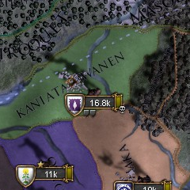
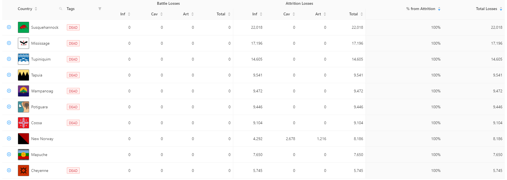

<div style={{textAlign: "center"}}>
  
</div>

With the advent of mega cities introduced in EU4 leviathan, we're encountering a new class of bugs: bugs where a country's force limit outstrips their entire supply limit. A player would be able to adapt by building to their supply limit instead of their force limit, but the AI is does not yet realize this:

<!--truncate-->

[](img1.jpg)
*Example 1: AI unable to supply their army*

[](img2.jpg)
*Example 2: AI unable to supply their army*

[](img3.jpg)
*Example 3: AI unable to supply their army*

Exceeding the supply limit can harm a country as it is a manpower drain and financial drain (as reinforcement fees must be paid).

This can be seen in the "Country Army Casualties Table" in Rakaly where a substantial number of countries have had a 100% of their casualties attributable to attrition:

[](attrition.png)
*Countries who have 100% of casualties attributed to attrition*

And while it is reasonable to hypothesize that the attrition could come from base racing enemies, this is not the case when a country has never been involved in a conflict:

[](attrition2.png)
*Mississage with all 17k casualties coming from attrition without war*

It is clear if one were to explore the other countries with a high percentage of casualties attributable to attrition that they tend to skew to the North America region and a significant portion of the attrition occurrs outside of war.

The fix seems like the AI would want to build to either their force limit or the minimum supply limit of all their provinces combined, whichever one is less. In pseudocode:

```plain
min(force_limit, sum(min(province_supply_limit)))
```

The temporary nature of monsoons and winters will need to be factored into the equation as well so that the AI isn't disbanding regiments for the winter only to rehire them in the spring.

[Bug reported on the forums](https://forum.paradoxplaza.com/forum/threads/eu-iv-ai-disregarding-attrition-when-building-to-force-limit-even-if-greater-than-supply-limit.1475420/)
