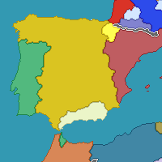
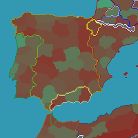
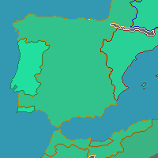

  

Sorry for the radio silence for the past 3 months -- we've been busy. A lot of effort went into this and I wanted to make sure this would pan out before breaking the news:

We have a new map 🎉!

The new map is a large departure from the original map. Essentially we had to start from scratch. If interested, I wrote up some [technical documentation](https://nickb.dev/blog/simulating-the-eu4-map-in-the-browser-with-webgl) about how we accomplished this and how it compares to other methods to simulate EU4's map. In short, I find map v2 to be the best in terms of realism, accuracy, performance, controls, and flexibility.

<!--truncate-->

Let's do a bit of a comparison.

*Old Map*

---

*New Map*

If you are a fan of the flat look or have a low end machine, you can render without the terrain overlay:

*New Map without terrain*

But more importantly, we have more map modes -- the #1 requested feature on the survey:

*Religious map mode*

*Development map mode*

*Technology map mode*

More map modes are on their way too!

Map v2 also debuts a new way to control the map. If you know how to use Google Maps then you know how to use Rakaly Map v2.

The old map was fast, but the new map cranks it to 11 through the power of the GPU. Any changes to the map are calculated instantly. 

`@crschnick`, from [Pdx-Unlimiter](https://github.com/crschnick/pdx_unlimiter) architected the map and wrote all the low level code, and you'll find them with the developer discord role!

Since no major flaws have been found in the week that the map has been in beta, the beta designator on the new map will be removed. The old map will continue to be available but will be moved to the end of the visualization list. When the majority users have switched to the new map, the old map will be removed (unless someone speaks up about why they like the old map better).

What's on the horizon?:

- More map modes
- Additional map controls
- View maps at a given date, though I'm not looking forward to creating a custom date picker as EU4 (and all paradox games) use a non-standard calendar.
- And if that goes well, it's conceivable to create a timeline between two dates
- And once we figure out a design that is flexible enough and easy to use, we can incorporate modifiers 
