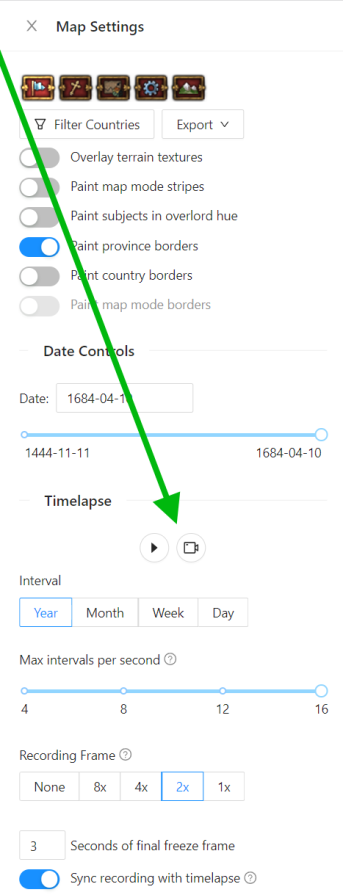

<div style={{textAlign: "center"}}>
  
</div>

The below video was generated entirely within the browser with [pdx.tools](https://pdx.tools) from my latest EU4 run where I took Naples and achieved Mare Nostrum. [Check out the save within pdx.tools](https://pdx.tools/eu4/saves/9B-cLT_jquAWPzPXgkykf).

<!--truncate-->

<video controls muted width='1110' >
  <source src={require("./slim.mp4").default} type="video/mp4"/>
</video>

You too can create a timelapse of your save by clicking on the globe (🌐) after loading a save on pdx.tools. There will be a video camera (🎥) to kick off the recording. Here are some instruction screenshots for those who are more visual learners:

[](record-1.png)
*First click on the globe*

[](record-1.png)
*Then the video camera*

There's tons of options. We can capture the entire world in a recording (feel free to maximize the video to get a better view).

<video controls muted width='2816' >
  <source src={require("./wide.mp4").default} type="video/mp4"/>
</video>

There's a lot to unpack, so strap in. 

## Prior Art

This isn't the first tool to create a timelapse map of an EU4 save. Some prior art:

- The Mare Nostrum DLC added a timeline feature (so it seems fitting that our debut timelapse is of Mare Nostrum).
- [eu4Replay](https://github.com/sapi/eu4Replay) (discontinued)
- [save2vid](https://github.com/Parnswir/save2vid) (discontinued)

I may be biased but I believe our timelapse tool is the best:

- pdx.tools requires no downloads, no installs, and no account necessary
- Ironman saves are supported (standard saves too if unmodded)
- Can capture the entire world or subslice at various resolutions
- High fidelity output
- Produces webm files (upload and view within discord)
- Produces mp4 files (upload and view within reddit)
- Small enough file size to upload to discord for free
- More accurate than EU4's own timelapse (as it occasionally stumbles on multiple tag switches)
- Recording is produced in real time
- Custom timelapse intervals and interval rates
- Date is embedded in the timelapse

And the best feature is that you can provide feedback!

Feedback is important as it helps us know where we should focus our time and if we should expand this feature to show timelapses of religion or striped provinces controlled by another country. 

For those curious about the watermark, it is to save content creators needing to answer the "how did you make this" question a million times. Or is that all a ruse and the truth is the watermark is a new monetization strategy? Don't worry, it's not, the watermark has been designed to be easy to remove for anyone skilled with video editing software.

## Technical Implementation

Save files contain province history that informs when a province changes hands. The example below has the province of Genoa (101) becoming owned by Naples on 1495-12-09.

```plain
provinces={
  -101={
    history={
      owner="GEN"
      1495.12.9={
        owner="NAP"
      }
    }
  }
}
```

The basic process to creating the timelapse is to calculate at a given year:

- Consider only province history entries prior to year
- Find the latest owner history entry
- Determine what tag the latest owner is now (in case the owner has gone through tag switches)
- Lookup the country color for this tag
- Fill the province with that country's color

Did you know when a colony is destroyed or a native tribe migrates that there is a history entry for it that sets the new owner to `"---"`:

```plain
1458.10.27={
    owner="---"
}
```

Despite not being a tag, it has its own country color, which is greyish:

```plain
countries={
  ---={
    colors={
      map_color={
        150 150 150
      }
    }
  }
}
```

So being owned by `"---"` is equivalent to being unowned.

As an aside, there's entries in the province history for every subsequent tag switch, using the `fake_owner` key, but we ignore those as we already know how to follow [save tag switching logic](/blog/tracking-tag-switches-in-eu4-save-files). I suspect `fake_owner` was added to make the timelapse feature easier to implement natively in EU4.

```plain
  1495.12.9={
    owner="NAP"
  }  
  1495.12.9={
    fake_owner="TTS"
  }
  1495.12.9={
    fake_owner="ITA"
  }
  1495.12.9={
    fake_owner="ROM"
  }
```

It's a shame that the `fake_owner` seems to only bloat the file, as it makes world conquest saves that tag switch more than a dozen times quite convoluted.

Back on topic, now that we know each province's color we go through the long process [simulating the EU4 map in the browser with WebGL](https://nickb.dev/blog/simulating-the-eu4-map-in-the-browser-with-webgl). This'll get us a static image of the map.

We rinse and repeat the process by incrementing to a new date, recalculating province colors, and redrawing the map. By chaining all the images together, we'll have ourselves a timelapse.

### Recording

An in-app timelapse is good, but half the fun is being able to easily share timelapses.

The first step to sharing a timelapse is recording it. Did you know that browsers have a [Media Recording API](https://developer.mozilla.org/en-US/docs/Web/API/MediaStream_Recording_API)? It's mostly associated with the [WebRTC API](https://developer.mozilla.org/en-US/docs/Web/API/WebRTC_API), but we'll be using it with just our timelapse canvas.

I foolishly believed that the solution would be simple. After all, isn't it just calling [`captureStream`](https://developer.mozilla.org/en-US/docs/Web/API/HTMLCanvasElement/captureStream) on our canvas and piping it to a [`MediaRecorder`](https://developer.mozilla.org/en-US/docs/Web/API/MediaRecorder)?

Turns out it is surprisingly difficult:

 - Chrome will start a timelapse recording too late and cut it off too soon, hacks were needed so that the timelapse doesn't proceed until recording has written the first frame and recording doesn't stop until the last timelapse frame is written
 - Embedding the date into the recording consists of copying the timelapse into a separate canvas that is better equipped to handle text
 - The recorder outputs a webm file, which has a couple drawbacks: it is not seekable and most upload sites don't accept webm video files. So we use an in-browser version of ffmpeg to transcode the video to mp4 before downloading (which has it's own issues).

After a bit more than a week all problems, have been solved or at least solved to an extent that is tolerable. If you're interested in a more thorough and technical explanation of everything, take a look at the [pull request](https://github.com/pdx-tools/pdx-tools/pull/91) that added the feature.
