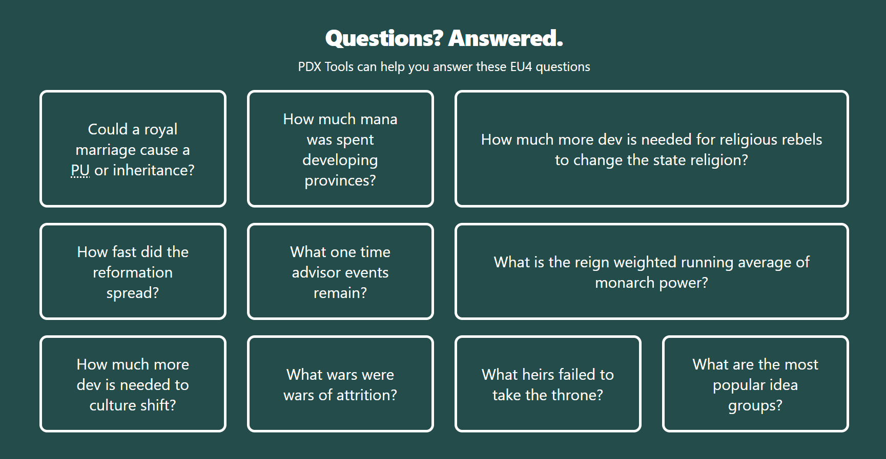

  

A couple weeks ago I updated the home page to include a list of questions that PDX Tools can help answer, as I feel like there are so many features that it is hard to keep track of them (even for myself). If features were phrased as questions, I hoped it'd be more obvious to users what PDX Tools offers. Sure, questions as a form of marketing is cool, but what about the answers? Hopefully with this new rollout, the ease of creating content will allow me to link the questions with tailored guides.

<!--truncate-->

*The list of the questions on the home page*

Well, a couple weeks have gone by and I've authored the first guide about [Royal Marriages, PUs, and Inheritance](/docs/eu4-guides/royal-marriage-inheritance/). It's not much but it should be a start to several more guides that highlight how PDX Tools can help inform the player.

But that's not all.

Site regulars will notice a few pages look different too:

- [Changelog](/changelog)
- [Blog](/blog)
- [API Docs](/docs/api)

Yup, this is the new home for all content: the PDX Tools Docs subsite. It's based on [Docusaurus](https://docusaurus.io/), which emphasizes reducing friction to publish content. And if the lack of help and blog content for PDX Tools is any indication, there was a lot of friction.

So all long form written content has been migrated here.

It will also be easier for others to contribute as every page now contains an "Edit this page". Get crackin!

Last but definitely not least, is that I expect a built in search functionality to be available within the next few weeks, as we should be eligible for [docsearch](https://docsearch.algolia.com). Then everything should be searchable, from blog to changelog to guides.

Time to get writing.