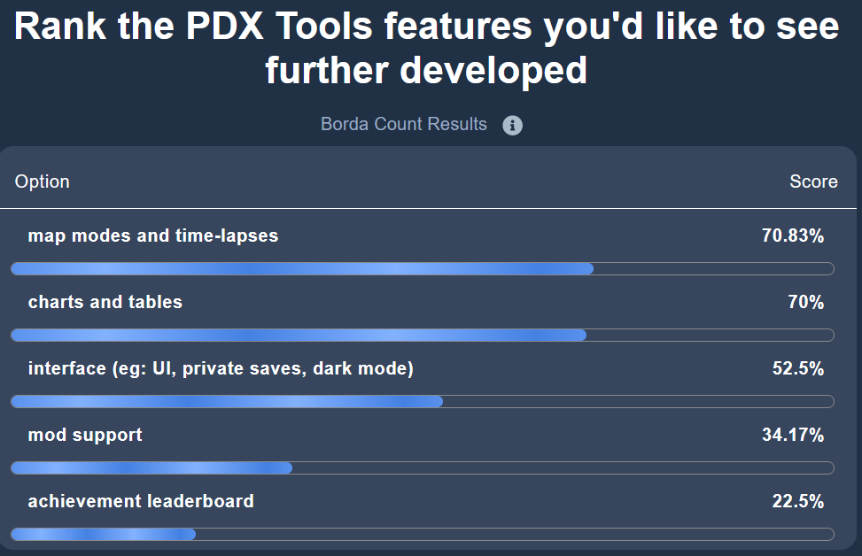

  

A user interest survey has been running for a bit over 10 days. Thank you to everyone who participated. It really does help shape the direction of PDX Tools.

Here are the results of the survey:

<!--truncate-->

*Ranked results from user interest survey*

The biggest takeaway, for at least this blog post, is that users don't have a strong interest in expanding the leaderboard; either by adding new EU4 achievements or adding achievement detection to other PDS titles.

As consequence here are some changes to PDX Tools:

- Uploads are no longer partially gated by requiring the save to crack an achievement leaderboard. All uploads are now treated the same.
- API keys need to be regenerated.
- The `/eu4/achievements` page no longer shows the current record for each achievement. One must navigate to the individual achievement to see the leaderboard

These changes have been done for two reasons:

- Eliminates the database used for leaderboard, making it easier to maintain and develop PDX Tools.
- Improves the user experience, as users no longer need to think about how achievements affect an upload

**Important**: For those who are achievement enjoyers, of which I consider myself a member of: achievements aren't going away. I will continue maintaining them if only to satisfy my desires, but I want them to be as easy to maintain as possible. And running a separate database just for achievements doesn't make sense anymore. 