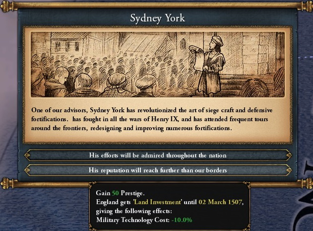
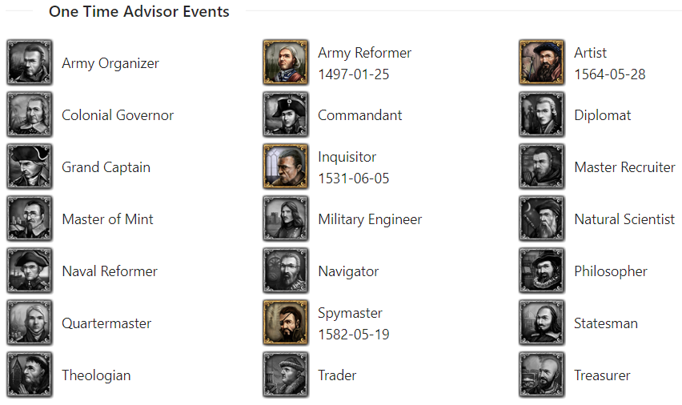

# One Time Advisor Events

Employing a 3 star or higher advisor allows access to a one time advisor event for each advisor type:

*A one time event for an Army reformer*

These events are also known as the great men events and can happen at most once per game per advisor type.

EU4 does not inform the player which one time advisor events have already triggered, so PDX Tools can step in and for each country, show which ones have triggered (and when). The advisors whose events remain are grayscale.

*PDX Tools status of one time advisor events*

This information can be used to help make an advisor selection, a military engineer and their event can significantly help stall the enemy in a defensive war. Or maybe you're not ready for the commandant event so you cycle your current 3 star commandant in and out of the advisor pool.