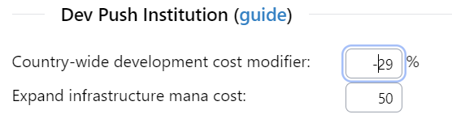
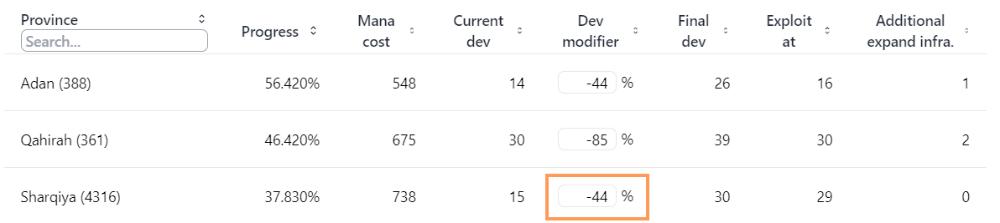
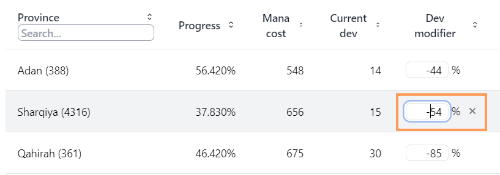

# Optimize Dev Push Institution

Are you jealous that an institution spawned halfway around the world and you need to dev push the institution in order to embrace it, but are not sure how much it will cost or what province to do it in? PDX Tools has you covered.

PDX Tools will show when to exploit development and expand infrastructure so you spend the least amount of mana to push an institution.

:::note
To get the most accurate results, follow along with EU4 paused, as we'll be recording in-game values.
:::

If you haven't already, load up [PDX Tools](/) with the save file of your choice.

Once loaded, dive into the Country Breakdown:

*The Country Breakdown location*

Navigate to the institution module, where we can see how many institutions the selected country has embraced. In the example we'll be working with, the Mamluks have yet to embrace Colonialism.

Using the province of Adan as an example, PDX Tools has calculated that the cheapest way to push the institution here is the following sequence:

- Dev from 14 to 15
- Expand infrastructure
- Dev from 15 to 16
- Exploit at 16
- Dev from 15 to 26.

The final cost will be 740 mana. This mana cost includes the cost to expand infrastructure.

## Superoptimization

By default, PDX Tools will assume a country wide development cost modifier of 0%, and will use a province-level development cost modifier based on several factors shown in the above screenshot (like terrain and trade goods).

This is fine to get a rough sense, but if we really want to know the optimal province to develop and its expected cost, we need in-game values.

Let's use the province of Sharqiya as an example. Loading up the game, we need to annotate the development cost modifiers for Sharqiya. We're going to split the modifiers into two categories: country-wide, marked with the globe emoji, and local, marked with the province icon.

*Sharqiya development cost modifier breakdown*

Adding up all the country-wide dev cost modifiers, we arrive at -29%. This means that all provinces owned by Mamluks receive at least a -29% development cost modifier.

The modifier we arrived at for the country-wide dev cost, is now reflected in the calculated development modifiers for each province. 

*Updated view with country-wide development modifier*

The dev modifier for Sharqiya has gone from -15% to -44% (-15 + -29). And the total mana cost to push an institution has dropped from 975 to 738.

Calculating the country-wide development cost modifier is oftentimes good enough, but sometimes you need exact answers. And for that, PDX Tools allows one to override the development modifier on an individual province basis.

Overriding a dev modifier for a province will disable the automatic detection of province development cost modifiers for only the overridden province.

Back to our Sharqiya example, adding the local modifiers to country-wide we arrive at -54% (-29 + -25%)

And now our cost pushing the institution in Sharqiya has dropped from 738 to 656 and has overtaken Qahirah as the 2nd most optimal province to develop an institution.

Inputting province dev modifiers is the most time consuming step, so if exactness is required, it is recommended to identify a few provinces of note and only override those.

## Dev efficiency

Those intimate with game mechanics may be wondering where development efficiency comes into play. Right now, the only development efficiency considered is from admin techs 17, 23, and 27, which are automatically detected and incorporated into the mana cost.
