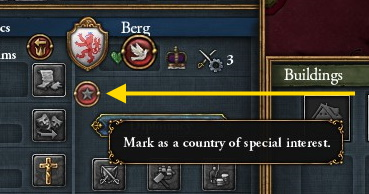
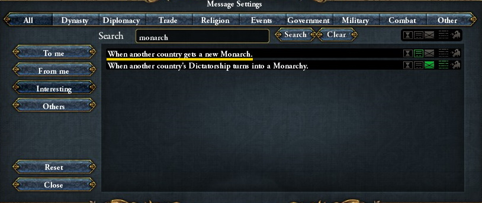
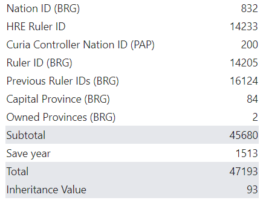

# Royal Marriages, PUs, and Inheritance

PDX Tools can facilitate diplomatically acquiring personal unions and inheriting countries through a royal marriage, as well as providing information about whether an existing junior partner is ripe for inheritance.

:::note
Securing a new PU via a casus belli is a viable strategy but is not covered in this guide.
:::

This guide will walk one through the game logic as well as a strategy for capitalizing on this info, and as such, is best followed along with EU4 and PDX Tools running side by side.

## Background

The chance to PU, inherit a country, or inherit an existing junior partner is deterministic and is dependant on the following factors:

- The target [nation ID](https://eu4.paradoxwikis.com/Countries#List_of_tags)
- The HRE ruler ID
- The curia controller's [nation ID](https://eu4.paradoxwikis.com/Countries#List_of_tags) (only if the junior partner is not catholic or if the curia is disabled).
- The target nation's current and past rulers
- The target nation's capital [province ID](https://eu4.paradoxwikis.com/Geographical_list_of_provinces)
- How many provinces the target nation owns
- Year

If one of these factors change, then the calculation can dramatically shift, so it is recommended to enable in-game notifications for these factors. Most relevant notifications are enabled by default like new curia controller and new emperor, but it can be beneficial to be notified when a country marked as a special interest either gets a new monarch or changes their capital as shown below.

[](interest.jpg)
*Marking another nation as a special interest*

[](monarch.jpg)
*Notified whenever a country of interest gets a new monarch*

[](capital.jpg)
*Notified whenever a country of interest moves their capital*

One can also opt to receive pop-up notifications for peace deals, but these don't tend to change the calculations too much unless a significant number of provinces change hands.

Nation IDs and province IDs remain static, so no notification is necessary.

## Inheritance Value Calculation

Below is a screenshot from PDX Tools (accessed via the country details pane) that breaks down the calculation of the inheritance value of a save in 1513 where Berg (tag: BRG) is the target nation that I am interested in diplomatically acquiring.

[](breakdown-1.png)
*Breakdown of inheritance values*

The inheritance value subtotal is calculated from all the listed factors (sans the year). Factoring in the year, gives us the total, which is then divided by 100, and the remainder is the inheritance value.

Or for those who like formulae.

```plain
inheritance value = (subtotal + year) % 100
```

Here's how to interpret an inheritance value if the target nation's ruler were to die heirless in the current year (broken down into tiers (T0, T1, T2)):

- T0: x < 75: spread dynasty
- T1: 75 <= x < 80: inheritance (unless succession war sparks)
- T2: x >= 80: personal union

Since this may be tough to visualize or plan for, PDX tools lists out when each tier occurs

[](breakdown-2.png)
*Breakdown of inheritance values*

Thus, in our example, Berg would come under my PU if:

- I royal married Berg
- Their ruler died heirless within the next 6 years with no changes to the inheritance value subtotal (ie: Curia controller, emperor, capital)
- Berg is at peace
- I am [the best claimant](https://eu4.paradoxwikis.com/Personal_union#Personal_union_through_diplomatic_means)

All this and the PU could be contested through a succession war

## Opportunistic Marriage Strategy

The opportunistic marriage strategy is a short term strategy designed to increase our luck surface area without totally disregarding the number of diplo relations. This strategy is inherently limited, as heirless rulers in T1/T2 that die when desired is very luck based. At the very least it can be a fun way to try and cheese EU4.

:::tip
Spreading your dynasty on monarch death (T0) is still a good strategy for long term interests as it increases your chance of PU in the future if the target country finds itself without an heir again (or if you want to claim the throne). The opportunistic marriage strategy is just focused on exploiting situations with additional data.
:::

The strategy:

- Get list of candidate countries via disputed succession notification:
  [](notification-banner.jpg)
  *Notification banner of heirless rulers*
- Filter list to only desired countries
- Load save into PDX Tools and check inheritance values
- Filter list to countries to those that have an inheritance value close to or above 75 (T1/T2) (and potentially exclude those who will soon enter T0 and there's slim chance likelihood of monarch death)
- Filter list to countries to those where you are [the best claimant](https://eu4.paradoxwikis.com/Personal_union#Personal_union_through_diplomatic_means). See the wiki for more details, but a good heuristic is you have the most development of all who share the same dynasty or have royal married the target.
- Send royal marriage and hopefully the heirless ruler dies when desired
- Repeat the entire process whenever world wide inheritance value subtotal fluxuates (ie: Curia controller, emperor), as countries that were previously in T0 may now be in T1 or T2.

In 1.33, there are pretty slim pickings at the 1444 start date, some young rulers need to die:

- A few Irish minors (Ulster, Tyrconnel, Offaly (probably the best one)).
- A couple German minors (Nassau, Berg)
- The best one may be England, who enters T1/T2 territory after a few in-game years, but even if the young king dies while at peace, one will most likely need to contend with France in a succession war.

The good news is that the constant churn of rulers could open up more interesting maneuvers like a play for Scotland or Bohemia if the curia controller changes hands or the emperor dies. Always keep an eye on inheritance value updates.  

:::info

Starting ruler IDs are stable, at least for a given patch (and subsequent patches too if rulers remain untouched), so rerolling a campaign won't influence the starting inheritance value subtotals

:::

Vassals, which won't show up under the disputed succession notification, can be inherited if in the T1 phase. A good example of this is the starting French vassal Orleans, who has an old ruler and enters T1 phase in 1446. So don't forget to marry your vassals if they don't share your dynasty! 

## Inheriting Junior Partners

We can use the inheritance value to determine if a current junior partner will be inherited whenever a new senior partner ruler is crowned via death or any other means.

First observe the reported inheritance chance when hovering over the personal union relationship.

[](inheritance-chance.png)
*Thuringia has an inheritance chance of 7*

Even though it is reported as a percentage, if the inheritance value is less than the inheritance chance, the junior partner gets inherited provided the union is 50 years old and the junior partner has positive relations.

For a list of inheritance chance factors, [see the wiki](https://eu4.paradoxwikis.com/Personal_union#Inheritance)

:::tip
Crafty players can use throne abdication if they want to force inheritance.
:::

## Resources

For more information, see:

- [How junior partner inheritance really works (Hint: it is not a dice roll) (Reddit)](https://www.reddit.com/r/eu4/comments/sfnba3/how_junior_partner_inheritance_really_workshint/?utm_source=share&utm_medium=web2x&context=3)
- [Johan posted source code](https://forum.paradoxplaza.com/forum/threads/how-junior-partner-inheritance-really-works-hint-it-is-not-a-dice-roll.1508465/post-28723263)
- [Atwix's guide to royal marriages, personal unions and claim throne.](https://forum.paradoxplaza.com/forum/threads/guide-to-royal-marriages-personal-unions-and-claim-throne.788829)
- [Radios Res' Personal Unions - An In-Depth Guide (Youtube)](https://youtu.be/seW0FRZdts4)

## Test Scenarios

To build an intuition for how the mechanics work, here are some scenarios to try out with console commands (executed on patch 1.33):

- Stettin starts in T1, so if the heir and ruler of Stettin die before 1447, Stettin gets inherited by Wolgast (who shares the same dynasty at the start) or by whoever also has a royal marriage, but with more development:
  ```
  kill_heir ste
  kill ste
  ```
- If the Orlean ruler dies between in 1446-1450 (T1), France inherits their vassal:
  ```
  date 1446.1.1
  kill orl
  ```
- Offaly becomes under a PU (T2) if you royal marry them and their ruler dies
  ```
  kill fly
  ```
